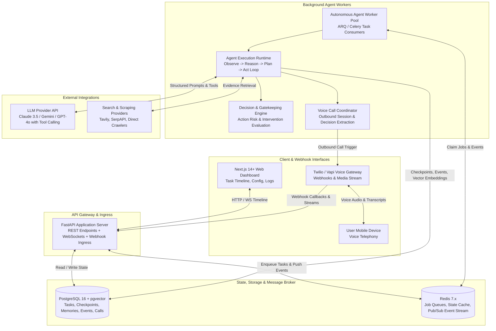
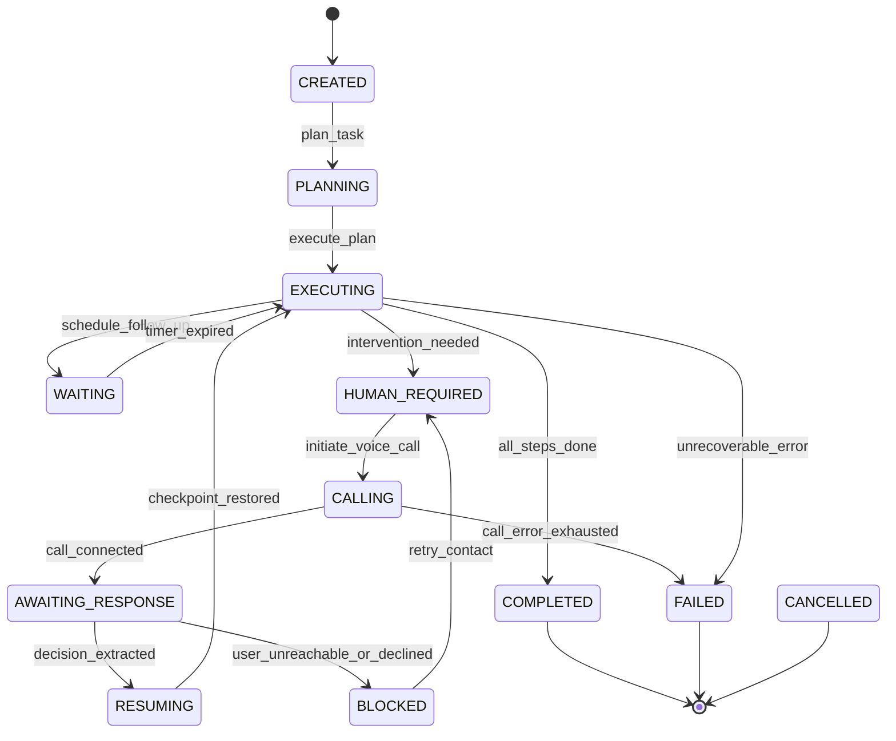
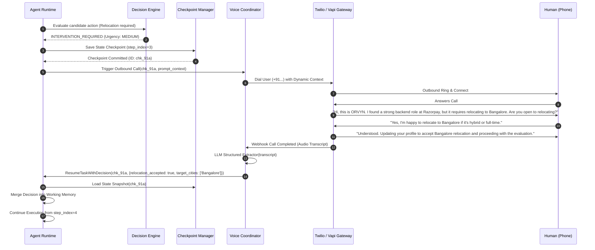

# ORVYN: System Architecture & Repository Design Specification
**Autonomous Human-in-the-Loop Voice Agent Platform**
*Author: Principal AI Systems Architect & Senior Software Engineer*
*Date: 2026-10-05*

---

## Executive Summary & Core Philosophy

ORVYN is designed around a single non-negotiable operational invariant:
> **ORVYN acts autonomously whenever it can, and interrupts the human via voice call only when human judgment, authorization, clarification, or intervention is genuinely required. After receiving the human's response, ORVYN resumes the interrupted task from its exact persistent checkpoint without repeating prior work.**

ORVYN rejects the paradigm of passive conversational chatbots. Instead, it is an **event-driven, persistent, deterministic state machine with an autonomous LLM runtime**, integrated with a voice telephony bridge and audit trails.

---

## 1. System Architecture

The high-level architecture separates synchronous API ingestion, long-running agent execution, telemetry, and telephony integration.



---

## 2. Component Architecture

```text
                                  +---------------------------------------+
                                  |             API Gateway               |
                                  |  (FastAPI Router, Auth, Webhooks)     |
                                  +-------------------+-------------------+
                                                      |
                                                      v
                                  +---------------------------------------+
                                  |         Agent Runtime Host            |
                                  |     (Task Lifecycle & Step Runner)    |
                                  +---+---------------+---------------+---+
                                      |               |               |
             +------------------------+               |               +-----------------------+
             v                                        v                                       v
+------------------------+               +------------------------+              +------------------------+
|     Planner Engine     |               |    Decision Engine     |              |     Memory Engine      |
| Goal Decomposition &   |               | Action Risk, Bounds &  |              | Profile, Episodic,     |
| Step DAG Generation    |               | Intervention Evaluator |              | Semantic (pgvector)    |
+------------------------+               +------------------------+              +------------------------+
             |                                        |                                       |
             +------------------------+               |               +-----------------------+
                                      v               v               v
                                  +---------------------------------------+
                                  |           Task Manager                |
                                  | Checkpoint Persistence, Lock & Resume |
                                  +-------------------+-------------------+
                                                      |
                                                      v
                                  +---------------------------------------+
                                  |       Specialized Sub-Agents          |
                                  |  (Opportunity, Research, Follow-Up)   |
                                  +-------------------+-------------------+
                                                      |
                                                      v
                                  +---------------------------------------+
                                  |             Tool Registry             |
                                  |   (Safe Read-Only vs External Tools)  |
                                  +---------+-------------------+---------+
                                            |                   |
                                            v                   v
                               +---------------------+ +-----------------+
                               | Evidence & Search   | | Voice Bridge    |
                               | (HTTP, Scraping)    | | (Twilio / Vapi) |
                               +---------------------+ +-----------------+
```

---

## 3. Repository Structure

```text
ORVYN/
├── .env.example
├── README.md
├── docker-compose.yml
├── docs/
│   └── ARCHITECTURE.md
│
├── backend/
│   ├── Dockerfile
│   ├── alembic.ini
│   ├── pyproject.toml
│   └── orvyn/
│       ├── main.py                    # FastAPI entrypoint
│       ├── config.py                  # Pydantic Settings
│       ├── core/                      # Kernel: logging, exceptions, event bus
│       ├── domain/                    # Pure Domain Entities: Task, Checkpoint, Decision, Call
│       ├── database/                  # SQLAlchemy async session, models, repositories
│       ├── engine/                    # Runtime loop, StateMachine, Planner, DecisionEngine
│       ├── memory/                    # User profile, episodic & pgvector store
│       ├── agents/                    # Opportunity, Research, Follow-Up agents
│       ├── tools/                     # Read-only and external tool registry
│       ├── telephony/                 # Twilio/Vapi bridge, conversation generator, extractor
│       ├── workers/                   # ARQ/Celery background task execution
│       └── api/                       # REST, WebSocket & Webhook routes
│
├── frontend/                          # Next.js 14+ TypeScript Dashboard
│   ├── src/
│   │   ├── app/                       # App router
│   │   ├── components/                # Timeline, Call visualizer, Intervention modal
│   │   └── lib/                       # API client
│
└── tests/
    ├── unit/
    └── integration/
```

---

## 4. Database Schema (PostgreSQL + pgvector)

```sql
CREATE EXTENSION IF NOT EXISTS "uuid-ossp";
CREATE EXTENSION IF NOT EXISTS "vector";

CREATE TYPE task_state_enum AS ENUM (
    'CREATED', 'PLANNING', 'EXECUTING', 'WAITING', 'BLOCKED',
    'HUMAN_REQUIRED', 'CALLING', 'AWAITING_RESPONSE', 'RESUMING',
    'COMPLETED', 'FAILED', 'CANCELLED'
);

CREATE TYPE call_status_enum AS ENUM (
    'INITIATED', 'RINGING', 'IN_PROGRESS', 'COMPLETED',
    'BUSY', 'NO_ANSWER', 'FAILED', 'CANCELLED'
);

CREATE TABLE tasks (
    id UUID PRIMARY KEY DEFAULT uuid_generate_v4(),
    user_id UUID NOT NULL,
    title VARCHAR(255) NOT NULL,
    objective TEXT NOT NULL,
    current_state task_state_enum NOT NULL DEFAULT 'CREATED',
    current_step_index INT NOT NULL DEFAULT 0,
    plan JSONB,
    state_metadata JSONB DEFAULT '{}',
    error_details JSONB,
    created_at TIMESTAMPTZ NOT NULL DEFAULT NOW(),
    updated_at TIMESTAMPTZ NOT NULL DEFAULT NOW(),
    completed_at TIMESTAMPTZ
);

CREATE TABLE task_checkpoints (
    id UUID PRIMARY KEY DEFAULT uuid_generate_v4(),
    task_id UUID NOT NULL REFERENCES tasks(id) ON DELETE CASCADE,
    step_index INT NOT NULL,
    step_name VARCHAR(100) NOT NULL,
    state_snapshot JSONB NOT NULL,
    resumption_token VARCHAR(64) NOT NULL,
    created_at TIMESTAMPTZ NOT NULL DEFAULT NOW()
);

CREATE TABLE events (
    id UUID PRIMARY KEY DEFAULT uuid_generate_v4(),
    task_id UUID REFERENCES tasks(id) ON DELETE CASCADE,
    correlation_id UUID NOT NULL,
    causation_id UUID,
    event_type VARCHAR(100) NOT NULL,
    payload JSONB NOT NULL,
    created_at TIMESTAMPTZ NOT NULL DEFAULT NOW()
);

CREATE TABLE human_interventions (
    id UUID PRIMARY KEY DEFAULT uuid_generate_v4(),
    task_id UUID NOT NULL REFERENCES tasks(id) ON DELETE CASCADE,
    checkpoint_id UUID NOT NULL REFERENCES task_checkpoints(id),
    reason TEXT NOT NULL,
    question TEXT NOT NULL,
    urgency VARCHAR(32) NOT NULL DEFAULT 'MEDIUM',
    context JSONB NOT NULL DEFAULT '{}',
    decision JSONB,
    resolved_at TIMESTAMPTZ,
    created_at TIMESTAMPTZ NOT NULL DEFAULT NOW()
);

CREATE TABLE voice_calls (
    id UUID PRIMARY KEY DEFAULT uuid_generate_v4(),
    intervention_id UUID NOT NULL REFERENCES human_interventions(id),
    task_id UUID NOT NULL REFERENCES tasks(id),
    external_call_sid VARCHAR(100),
    to_phone_number VARCHAR(32) NOT NULL,
    status call_status_enum NOT NULL DEFAULT 'INITIATED',
    transcript TEXT,
    extracted_decision JSONB,
    confidence_score FLOAT,
    duration_seconds INT DEFAULT 0,
    started_at TIMESTAMPTZ,
    ended_at TIMESTAMPTZ,
    created_at TIMESTAMPTZ NOT NULL DEFAULT NOW()
);

CREATE TABLE memories (
    id UUID PRIMARY KEY DEFAULT uuid_generate_v4(),
    user_id UUID NOT NULL,
    category VARCHAR(64) NOT NULL,
    content TEXT NOT NULL,
    structured_data JSONB DEFAULT '{}',
    provenance_source VARCHAR(255) NOT NULL,
    provenance_reference VARCHAR(512),
    confidence FLOAT NOT NULL DEFAULT 1.0,
    embedding vector(1536),
    created_at TIMESTAMPTZ NOT NULL DEFAULT NOW(),
    updated_at TIMESTAMPTZ NOT NULL DEFAULT NOW()
);

CREATE TABLE opportunities (
    id UUID PRIMARY KEY DEFAULT uuid_generate_v4(),
    user_id UUID NOT NULL,
    title VARCHAR(255) NOT NULL,
    organization VARCHAR(255) NOT NULL,
    opportunity_type VARCHAR(64) NOT NULL,
    url VARCHAR(512),
    location VARCHAR(255),
    is_remote BOOLEAN DEFAULT FALSE,
    deadline TIMESTAMPTZ,
    requirements JSONB DEFAULT '[]',
    relevance_score FLOAT DEFAULT 0.0,
    status VARCHAR(64) NOT NULL DEFAULT 'DISCOVERED',
    discovered_at TIMESTAMPTZ NOT NULL DEFAULT NOW()
);
```

---

## 5. Agent State Machine



---

## 6. Voice Integration & Resumption Sequence



---

## 7. The Smallest Executable Vertical Slice (Phase 01)

Before large-scale expansion, Phase 01 delivers the complete end-to-end loop:
1. **Task Initialization**: Submit objective *"Find backend engineering opportunities in Bangalore"*.
2. **State Machine Execution**: Transitions `CREATED` -> `PLANNING` -> `EXECUTING`.
3. **Decision Engine Trigger**: Identifies that user's relocation preference is unrecorded; flags `HUMAN_REQUIRED`.
4. **Checkpoint Snapshot**: State frozen and saved to DB with unique resumption token.
5. **Voice Intervention Dispatch**: Outbound call initiated to the user's phone via Voice Bridge.
6. **Telephony Ingress & Extraction**: Voice transcript ingested via webhook and parsed into structured JSON decision (`{"relocation_accepted": true, "location": "Bangalore"}`).
7. **Zero-Loss Resumption**: State machine transitions `AWAITING_RESPONSE` -> `RESUMING` -> `EXECUTING`, restores the frozen checkpoint, records the decision with provenance, and completes the opportunity evaluation.
8. **Audit Trail**: Every state transition, checkpoint, event, and call transcript recorded in the database.
